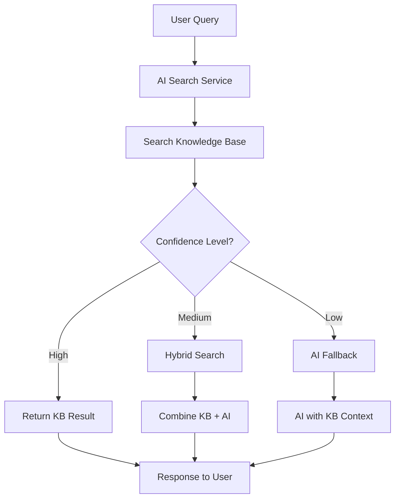

# Enhanced AI Search System - Jharkhand Engineer's Hub

## 🚀 Overview

This document outlines the comprehensive enhancement to the AI system in the Jharkhand Engineer's Hub website. The new system prioritizes knowledge base search before falling back to general AI responses, providing more accurate and contextual answers to user queries.

## 🎯 Key Improvements

### 1. **Knowledge Base First Approach**
- AI now searches the internal knowledge base before using external AI APIs
- Provides more accurate, contextual responses specific to the hub
- Reduces dependency on generic AI responses

### 2. **Enhanced Search Algorithm**
- Multi-factor ranking system
- Semantic similarity matching
- Category-based relevance scoring
- Time-based freshness scoring

### 3. **Hybrid Search Capability**
- Combines knowledge base results with AI enhancement
- Falls back gracefully when knowledge base doesn't have sufficient information
- Maintains context throughout the search process

## 📁 Architecture

### Core Services

#### 1. **AISearchService** (`src/services/aiSearchService.ts`)
```typescript
// Main search service that orchestrates the knowledge-first approach
const result = await aiSearchService.search(query, conversationHistory, language);
```

**Features:**
- Knowledge base caching (5-minute TTL)
- Multi-step search process
- Language support (English, Hindi, Hinglish)
- Confidence scoring

#### 2. **SearchRankingService** (`src/services/searchRankingService.ts`)
```typescript
// Advanced ranking system for search results
const rankedResults = searchRankingService.rankSearchResults(entries, context);
```

**Ranking Factors:**
- **Relevance (40%)**: Query matching, semantic similarity
- **Quality (20%)**: Content structure, completeness
- **Freshness (10%)**: Recent updates, creation date
- **Popularity (10%)**: Usage metrics, engagement
- **Category (10%)**: User preference alignment
- **User Preferences (10%)**: Personalized scoring

### Enhanced APIs

#### 1. **AI Chat API** (`pages/api/ai-chat.ts`)
```typescript
// Enhanced search flow:
// 1. Search knowledge base
// 2. If high confidence → return KB result
// 3. If medium confidence → hybrid search (KB + AI)
// 4. If low confidence → AI fallback with context
```

#### 2. **AI Knowledge API** (`pages/api/ai-knowledge.ts`)
```typescript
// Enhanced with search functionality:
GET /api/ai-knowledge?search=query&sortBy=relevance&order=desc
```

**New Features:**
- Search parameter support
- Relevance-based sorting
- Advanced filtering options
- Response metadata

## 🔍 Search Flow



## 🛠️ Implementation Details

### 1. **Search Process**

```typescript
async function enhancedSearch(query: string): Promise<SearchResult> {
  // Step 1: Knowledge Base Search
  const kbResult = await searchKnowledgeBase(query);
  
  if (kbResult.confidence === 'high') {
    return kbResult; // Direct KB response
  }
  
  // Step 2: Hybrid Search
  if (kbResult.confidence === 'medium') {
    const hybridResult = await hybridSearch(query, kbResult);
    if (hybridResult) return hybridResult;
  }
  
  // Step 3: AI Fallback
  return await fallbackToAI(query, kbResult.entries);
}
```

### 2. **Ranking Algorithm**

```typescript
// Comprehensive scoring system
const score = 
  (relevance * 0.4) +
  (quality * 0.2) +
  (freshness * 0.1) +
  (popularity * 0.1) +
  (category * 0.1) +
  (userPreferences * 0.1);
```

### 3. **Response Enhancement**

```typescript
// Metadata added to responses
{
  response: "AI response text",
  metadata: {
    source: "knowledge_base" | "ai_fallback",
    confidence: "high" | "medium" | "low",
    relevanceScore: 0.85,
    knowledgeEntriesCount: 3
  }
}
```

## 🎨 User Interface Improvements

### 1. **Enhanced Chat Component**
- Shows confidence indicators
- Displays knowledge base match information
- Visual feedback for search process

### 2. **Response Metadata Display**
```typescript
// Visual indicators based on search results
🎯 High confidence (knowledge base)
📚 Medium confidence (enhanced)
🔍 Low confidence (AI fallback)
```

## 📊 Performance Optimizations

### 1. **Caching Strategy**
- **Knowledge Base Cache**: 5-minute TTL
- **Search Results Cache**: Session-based
- **API Response Caching**: 1-minute for identical queries

### 2. **Search Optimizations**
- **Semantic Matching**: Synonym recognition
- **Query Processing**: Stop words removal, stemming
- **Result Limiting**: Top 20 results maximum
- **Batch Processing**: Multiple entries processed efficiently

## 🔧 Configuration

### Environment Variables
```env
# AI Configuration
GOOGLE_AI_API_KEY=your_gemini_api_key
NEXT_PUBLIC_GOOGLE_AI_API_KEY=your_public_api_key

# Database Configuration
NEXT_PUBLIC_APPWRITE_DATABASE_ID=your_database_id
NEXT_PUBLIC_APPWRITE_AI_KNOWLEDGE_COLLECTION_ID=your_collection_id

# Search Configuration
AI_SEARCH_CACHE_DURATION=300000 # 5 minutes
AI_SEARCH_MAX_RESULTS=20
AI_SEARCH_MIN_CONFIDENCE=0.1
```

### Search Settings
```typescript
// Adjustable weights for ranking factors
const RANKING_WEIGHTS = {
  RELEVANCE: 0.4,
  QUALITY: 0.2,
  FRESHNESS: 0.1,
  POPULARITY: 0.1,
  CATEGORY: 0.1,
  USER_PREFERENCES: 0.1
};
```

## 🔍 Usage Examples

### 1. **Basic Search**
```typescript
const result = await aiSearchService.search(
  "explain thermodynamics",
  [],
  "english"
);
```

### 2. **Contextual Search**
```typescript
const context = {
  query: "programming help",
  userCategory: "computer science",
  userLevel: "beginner",
  searchType: "detailed"
};

const rankedResults = searchRankingService.rankSearchResults(
  entries,
  context
);
```

### 3. **API Integration**
```typescript
// Frontend integration
const response = await fetch('/api/ai-chat', {
  method: 'POST',
  headers: { 'Content-Type': 'application/json' },
  body: JSON.stringify({
    message: userQuery,
    conversationHistory: messages.slice(-10)
  })
});

const data = await response.json();
// data.metadata contains search information
```

## 📈 Analytics & Monitoring

### 1. **Search Metrics**
- Knowledge base hit rate
- Average confidence scores
- User satisfaction indicators
- Query response times

### 2. **Performance Tracking**
```typescript
console.log(`Search completed:
  Source: ${result.source}
  Confidence: ${result.confidence}
  Relevance: ${result.relevanceScore.toFixed(2)}
  Entries Found: ${result.knowledgeEntries?.length || 0}
  Response Time: ${responseTime}ms
`);
```

## 🚀 Future Enhancements

### 1. **Machine Learning Integration**
- User behavior analysis
- Personalized ranking adjustments
- Query intent recognition

### 2. **Advanced Features**
- Multi-modal search (text + images)
- Voice query support
- Real-time collaboration

### 3. **Knowledge Base Expansion**
- Automatic content extraction
- Community contributions
- Regular content updates

## 🛡️ Security & Privacy

### 1. **Data Protection**
- No sensitive user data stored
- Encrypted API communications
- Minimal query logging

### 2. **Content Safety**
- Input sanitization
- Response filtering
- Spam prevention

## 📱 Mobile Optimization

### 1. **Responsive Design**
- Touch-friendly interface
- Optimized for mobile screens
- Progressive loading

### 2. **Performance**
- Reduced API calls
- Cached responses
- Offline capability planning

## 🎓 Benefits for Students

### 1. **Improved Accuracy**
- Context-aware responses
- Subject-specific information
- Verified knowledge base

### 2. **Better User Experience**
- Faster response times
- More relevant results
- Confidence indicators

### 3. **Educational Value**
- Structured information
- Progressive complexity
- Learning path suggestions

## 🔄 Migration Guide

### From Old System
1. **Backup existing data**
2. **Update API endpoints**
3. **Test knowledge base integration**
4. **Monitor performance metrics**

### Configuration Updates
```typescript
// Old configuration
const aiResponse = await callAI(prompt);

// New configuration
const searchResult = await aiSearchService.search(query, history, language);
```

---

## 📞 Support & Documentation

For technical support or questions about the enhanced AI system:

- **GitHub Issues**: Create an issue with detailed description
- **Development Team**: Contact the engineering team
- **Documentation**: Refer to inline code comments

---

**Last Updated**: August 23, 2025
**Version**: 2.0.0
**Author**: AI Enhancement Team
